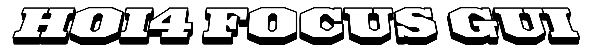

 

 

---

### Independent Software, Game Tools, and Modding Infrastructure

Self-taught dev focused on practical tools, game mods, desktop apps, and technical experiments without a fixed disciplinary boundary.

My current work is concentrated around **Hearts of Iron IV development tooling**, **NeoForge Minecraft mods**, **procedural game systems**, and **developer utilities** that reduce repetitive work or make complex content easier to build.

I am based in the Pacific Northwest and generally work as a solo developer, carrying projects from early systems design through implementation, interface design, testing, documentation, packaging, and release.

---

## Profile

<table>
<tr>
<td width="50%" valign="top">

### Current Focus

* Building reusable tooling for Hearts of Iron IV mod development
* Developing NeoForge mods for modern Minecraft versions
* Designing desktop utilities for structured game-data editing
* Prototyping procedural simulation and strategy systems
* Improving workflows for large, data-heavy creative projects
* Publishing practical tools that can operate outside a development environment

</td>
<td width="50%" valign="top">

### Development Priorities

* Clear interfaces over opaque automation
* Deterministic output where reproducibility matters
* Modular architecture over tightly coupled feature growth
* Local-first software where cloud infrastructure is unnecessary
* Progressive disclosure for complex technical workflows
* Tools that remain useful after the original project is complete

</td>
</tr>
</table>

---

## Technical Work

My projects often sit between software engineering, game development, technical design, and content-production infrastructure.

Rather than limiting work to a single engine or programming language, I select technologies according to the constraints of the project. This may involve a Python desktop application for structured data editing, JavaScript for an interactive browser prototype, Java for Minecraft modding, or domain-specific scripting for a grand-strategy modification.

Common project characteristics include:

* Large collections of structured game data
* Custom editors and visualization tools
* Procedural or deterministic generation
* Save-compatible gameplay systems
* Desktop packaging and standalone distribution
* Mod interoperability and defensive compatibility checks
* Data validation, migration, and normalization
* Custom user interfaces for systems not represented well by standard tooling

---

## Languages and Technologies

### Primary Languages

  

  

### Frameworks, Platforms, and Tools

  

---

## Areas of Interest

<table>
<tr>
<td width="33%" valign="top">

### Game Development

* Strategy and simulation systems
* City-building mechanics
* Procedural environments
* Data-oriented game architecture
* Modding frameworks
* Editor tooling
* Save systems
* Game-state visualization

</td>
<td width="33%" valign="top">

### Software Development

* Desktop applications
* Local-first utilities
* Structured-data editors
* Automation pipelines
* Validation systems
* Content generators
* Repository tooling
* Standalone packaging

</td>
<td width="33%" valign="top">

### Interface Design

* Dense technical interfaces
* Progressive disclosure
* Tooltips and contextual documentation
* Information hierarchy
* Data visualization
* Editor ergonomics
* Keyboard-oriented workflows
* Responsive application layouts

</td>
</tr>
</table>

---

## Featured Projects

<table>
<tr>
<td align="center" valign="top" width="50%">

### HOI4 Focus GUI

 

A Python-based desktop toolkit for creating and editing Hearts of Iron IV national focus trees through a visual interface.

The project is intended to reduce the friction involved in positioning focus nodes, managing dependencies, editing metadata, and producing structured focus-tree script without requiring every operation to be performed manually in text files.

**Primary concerns**

* Visual focus-tree editing
* Structured HOI4 script generation
* Standalone Windows distribution
* Faster iteration for mod developers
* Reduced syntax and layout errors

 

</td>
<td align="center" valign="top" width="50%">

### Universal Compression

 

A NeoForge Minecraft mod that dynamically allows compatible blocks to be compressed into progressively denser forms across as many as nine tiers.

The system discovers supported content at runtime, generates required behavior without creating a large static datapack footprint, and provides configurable exclusion controls for blocks or namespaces that should not participate.

**Primary concerns**

* Automatic mod compatibility
* Runtime content generation
* Nine compression tiers
* Configurable exclusion rules
* Clear tier identification
* Minimal manual setup

 

</td>
</tr>
</table>

---

## Project Categories

<strong>Hearts of Iron IV Development</strong>

 

My HOI4-related work focuses on improving the development process for projects that exceed the practical limits of manual text editing.

Relevant areas include:

* Visual national-focus editing
* Script and localisation generation
* Mod structure validation
* Custom political interfaces
* Scripted graphical user interfaces
* Election and legislature systems
* Save-data interpretation
* Content migration and normalization
* Reusable developer-facing frameworks
* VS Code extensions and language tooling

The underlying objective is to make complex HOI4 development more inspectable, repeatable, and maintainable without hiding the resulting game code from the developer.

<strong>Minecraft Mod Development</strong>

 

My Minecraft projects primarily target NeoForge and emphasize compatibility, procedural registration, reusable mechanics, and configuration-driven behavior.

Typical technical concerns include:

* Dynamic block and item generation
* Runtime recipe and loot behavior
* Resource and texture generation
* Cross-mod compatibility
* Namespace filtering
* Persistent configuration
* Performance across large modpacks
* Clear installation and troubleshooting documentation

<strong>Game and Simulation Prototypes</strong>

 

I also develop experimental systems for strategy games, city builders, procedural worlds, and browser-based simulations.

These projects commonly explore:

* Chunked or effectively unbounded worlds
* Procedural terrain
* Road and settlement generation
* Resource simulation
* Data-oriented entities
* Local save formats
* Deterministic generation
* WebGL and WebGPU rendering
* Desktop and browser deployment
* Mod-oriented architecture

<strong>Desktop and Developer Utilities</strong>

 

A significant portion of my work involves building custom tools for workflows that are too specialized for general-purpose software.

Examples include:

* Structured-data editors
* Image-processing utilities
* Asset conversion tools
* Validation and diagnostics
* Batch content generation
* Mod packaging utilities
* Interactive documentation
* Repository maintenance tools
* Local project dashboards

---

## Development Approach

I generally begin with the smallest complete workflow that proves a system can function, then expand it without sacrificing inspectability.

A useful tool should expose what it is doing, preserve the developer's ability to edit generated output, and fail in a way that provides actionable information. Automation is most valuable when it removes repetitive labor without making the resulting project dependent on an undocumented black box.

My preferred project characteristics are:

1. **Practical before ornamental**
   The central workflow should function before secondary presentation work dominates development.

2. **Deterministic where possible**
   Identical inputs should produce identical outputs unless variation is an explicit feature.

3. **Modular by responsibility**
   User interface, data processing, persistence, validation, and rendering should remain separable.

4. **Inspectable output**
   Generated files should remain readable and editable by a developer.

5. **Compatibility-aware**
   Tools and mods should account for missing content, version differences, and third-party integrations.

6. **Local-first**
   Projects should not require remote services when the same capability can be delivered reliably on the user's machine.

7. **Documentation as infrastructure**
   Installation instructions, data formats, error conditions, and extension points are treated as part of the software.

---

## Repository Philosophy

Not every repository on this profile is intended to represent a finished commercial product.

Some repositories are:

* Production tools
* Released game modifications
* Research prototypes
* Technical demonstrations
* Archived experiments
* Shared foundations for later work
* Purpose-built utilities for a larger private project

Repository maturity, support expectations, and intended use should be documented within each project.

Where a project has releases available, the release build is generally the preferred option for users who do not need to modify the source.

---

## GitHub Activity

<table>
<tr>
<td align="center" valign="top">

</td>
<td align="center" valign="top">

</td>
</tr>
<tr>
<td align="center" valign="top">

</td>
<td align="center" valign="top">

</td>
</tr>
</table>

 

---

## Selected Principles

> Build the tool that removes the obstacle, not the abstraction that merely relocates it.

> Complexity is acceptable when it is structured, visible, and justified by the problem.

> A usable first implementation is more valuable than an elaborate architecture with no complete workflow.

> Generated content should remain understandable to the person expected to maintain it.

---

## Find Me Elsewhere

  

Open-source work, development notes, mod releases, demonstrations, and longer-form project material are distributed across these platforms.

---

Independent developer • Pacific Northwest • Tools, mods, simulations, and technical experiments

  

